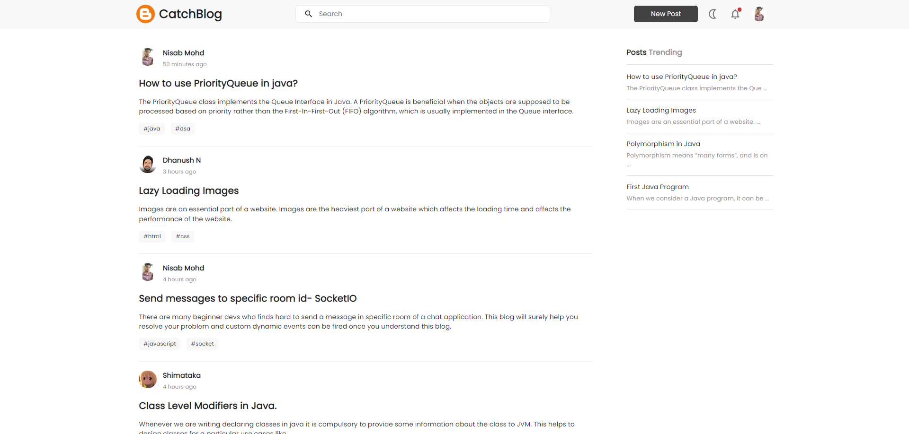
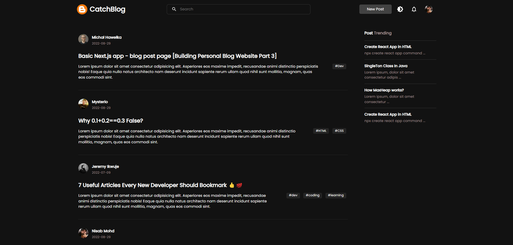
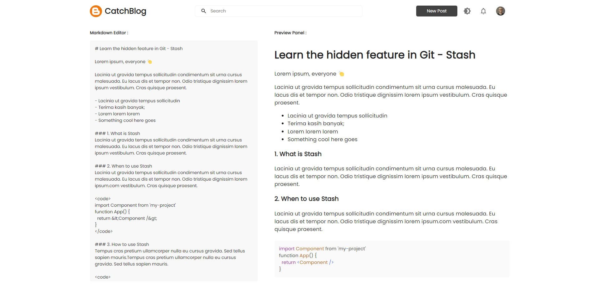
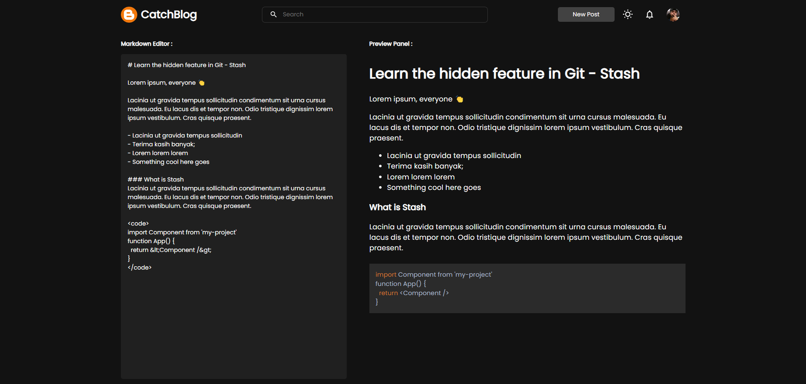
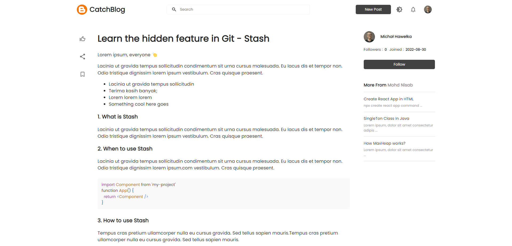
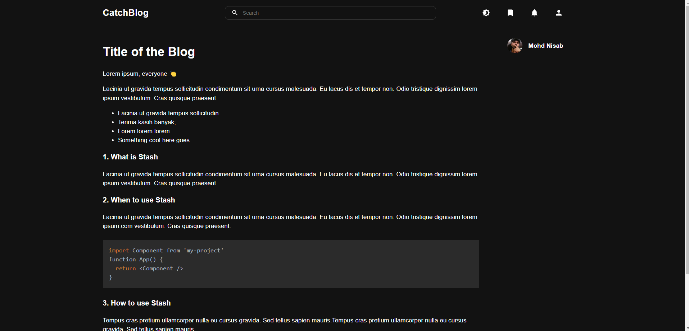

# CatchBlog.
Welcome to CatchBlog.
CatchBlog is an open source online blog page for devs.

##  Features 
- *MarkDown support* 
- One tap Google login
- Markdown code syntax highlight

## Prerequisites
Make sure you have installed all of the following prerequisites on your development machine:
* Git - [Download & Install Git](https://git-scm.com/downloads). OSX and Linux machines typically have this already installed.
* Node.js - [Download & Install Node.js](https://nodejs.org/en/download/) and the npm package manager. If you encounter any problems, you can also use this 

```bash
$ npm install 
```

## Downloading CatchBlog
There are several ways you can get the CatchBlog:

### Cloning The GitHub Repository
The recommended way to get CatchBlog is to use git to directly clone the CatchBlog repository:

```bash
$ git clone https://github.com/nisabmohd/CatchBlog
```
This will clone the latest version of the CatchBlog repository to a **CatchBlog** folder.


## Quick Install
To install the dependencies, run this in both client and backend folder from the command-line:
```bash
$ npm install
```
## Running Your Application

Run your application using npm:

&#8594; server start
```bash
$ cd server
$ node server
```

&#8594; client start
```bash
$ cd client
$ npm start
```

* Your client application should run on port 3000 with the *development* environment configuration, so in your browser just go to [http://localhost:3000](http://localhost:3000)

* Your server application should run on port 8000, so in your browser just go to [http://localhost:8000](http://localhost:3000)

## Overview

#### Home Page



#### New Post



#### Blog Page


